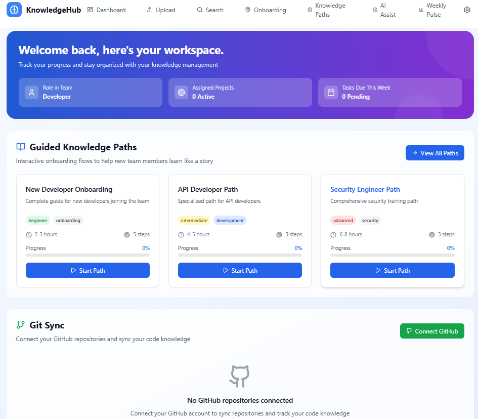
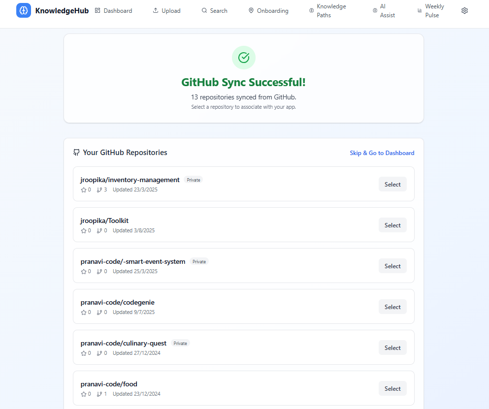
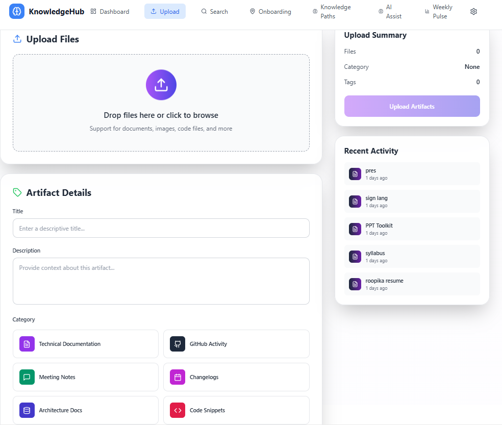
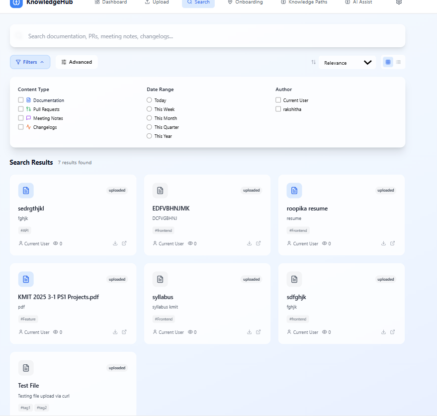
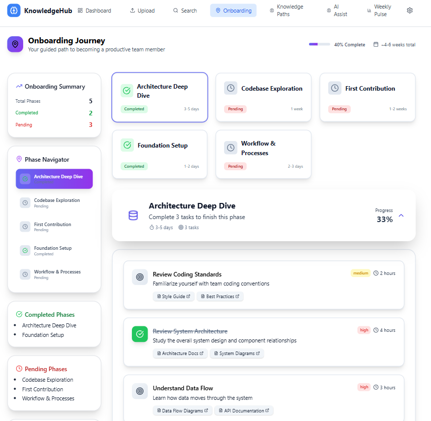
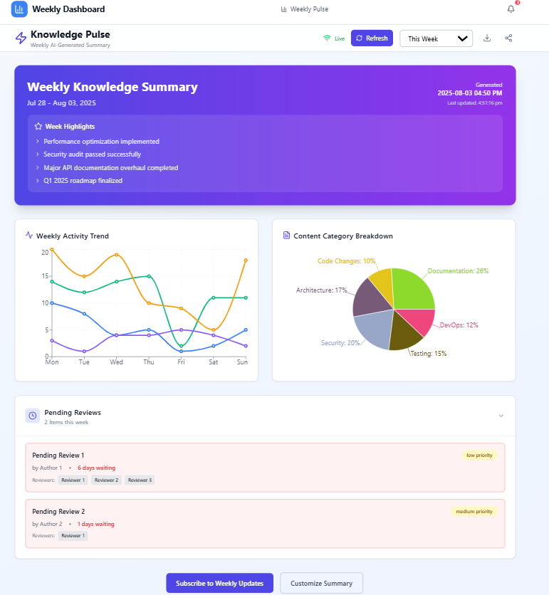
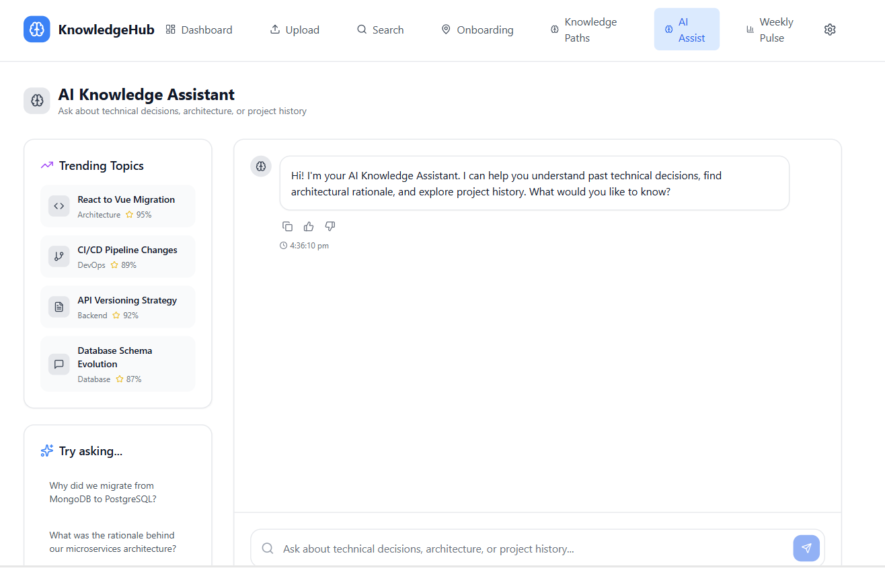

# 🚀 KnowledgeHub – Centralized Knowledge & Onboarding Platform for Engineering Teams

KnowledgeHub is a smart and modern web platform that helps fast-paced technical teams manage and retain critical knowledge. It offers a centralized space for storing code artifacts, documents, onboarding guides, and project updates — ensuring teams never lose important information again.

---

## 🧠 Problem It Solves

In most organizations, knowledge is scattered across chats, inboxes, folders, and local notes. When developers leave, switch teams, or new ones join, that knowledge often disappears — leading to confusion, slow onboarding, and repeated mistakes.

🔎 **KnowledgeHub** solves this with:
- Centralized storage of all engineering knowledge  
- Easy-to-follow onboarding paths for new devs  
- Fast, filtered search for all project artifacts  

---

## 📸 Screenshots

### 🔷 Dashboard – Personalized Workspace  

### 📤 Upload – Artifact Submission with Context  

### 🔎 Search – Filter & Find Instantly  

### 🗺️ Onboarding

### 🧭 Knowledge Paths

### 📊 Weekly Pulse Dashboard

### 🤖 AI Assist

---

## ✨ Key Features

- 📁 **Upload Artifacts**  
  Upload design docs, code files, meeting notes, and more — tag them for easy retrieval.

- 🧭 **Guided Knowledge Paths**  
  Break onboarding into structured learning paths for different roles (Dev, Security, API, etc.)

- 🔍 **Powerful Search**  
  Search knowledge by category, tag, contributor, or date.

- 📊 **Weekly Pulse**  
  Visual insights into team activity and uploaded knowledge over time.

- 🤖 **AI Assist (Optional)**  
  Integrate smart suggestions or summarization (experimental).

---

## 🛠️ Tech Stack

| Layer      | Technologies                       |
|------------|------------------------------------|
| Frontend   | React, Tailwind CSS, React Router, Lucide Icons |
| Backend    | **Flask**, Python (for APIs and logic) |
| Dashboard  | Recharts, WebSockets (real-time updates) |
| State Mgmt | useState, useEffect (React Hooks)  |
| Routing    | React Router DOM                   |

---

